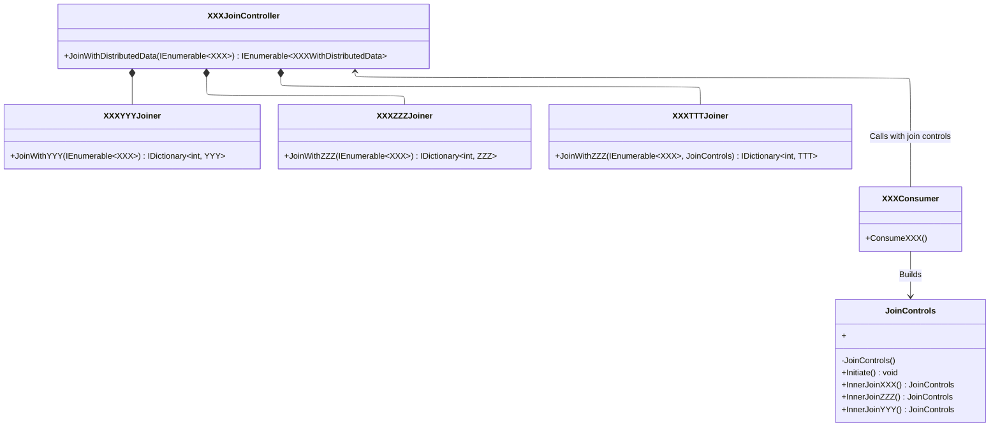

# Distributed Joins

Distributed join is a pattern for HTTP-based microservices.
They allow streamlining remote service consumption on a single interface basis with optimum performance following HTTP clients' usage best practices.

# Patterns and sub-patterns

Distributed joins englobes an ensemble of collaborating sub-patterns.

## Joiner pattern

Joiner classes have JoinWith methods.
JoinWith method: 
   - Fetches entities from the local service repository by the provided ID list in the method parameter.
   - Returns a mapping of remote entities by local entity ID.
     
## Join Controller pattern

JoinController classes have JoinProductWithDistributedData method.
JoinProductWithDistributedData method:
  - Conditions join calls based on the Join Controls values provided in the method parameter.

## Join Controls pattern

JoinControl records conditions JoinController class behavior.
They hold boolean properties that are built by consumers.
Consumers can benefit from a fluent, builder-pattern-based join controls creation syntax using custom build methods that are defined in the same record.

# Class Diagram

# Use cases
The Distributed Join pattern is applied in a context of HTTP-based distributed architectures in case you need:
  - Build performant and solid Infrastructure layer logic for joining local and remote service entities with tackling the most common pitfalls with HTTP-based communications.
  - Abstracting remote service aggregation logic into a single class for multiple consumer usage.
  - A declarative DDD-oriented approach that demegates service aggregation logic into a class holding a central responsibility.
  - A rich domain layer with only service related logic.
  - An [API Composition pattern](https://microservices.io/patterns/data/api-composition.html) with performant and centralized remote HTTP services aggregation. 
  
# Repository usage

## Prerequisites

The solution is currently built using .NET 9.
.NET SDK is mondatory for building and running the solution.

## Build

Build the demonstrative solution using the sln file under the root folder.

## Run

Run the API project under src/API folder using dotnet run command.

# Enhancements

- Managing not found user / rating references with null tolerant mapping with remote services.
- Exception handling and possibility to configure exception settings from calling consumer code, like done for join controls.